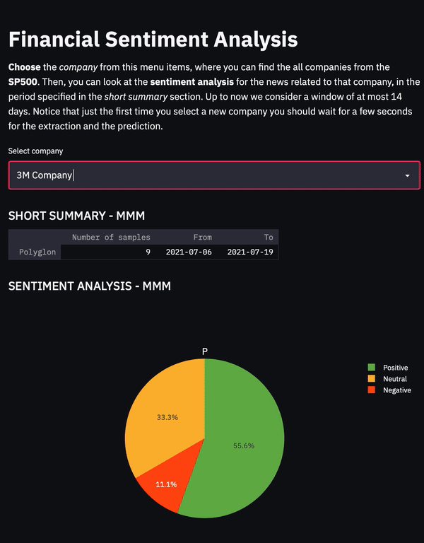

# Financial Sentiment Analysis project

Libraries: 

## Contents
- [Description](#description)
- [Dataset](#dataset)
- [Task](#task)
- [Solutions](#solutions)
- [Demo](#demo)

------------------------
# Description
Development of a custom sentiment analysis model related to **financial news**

# Dataset
Data are extracted by *scraping* **yahoo finance** and **twitter posts**

# Task
Text Classification

# Solutions
- Existent Models
  - Spacy model
  - Bert model

---------
- Custom Models
  - CNN Network
  - *CNN-LSTM Network* (**Work in progress**)

------------------------

# Demo

#### Authors

