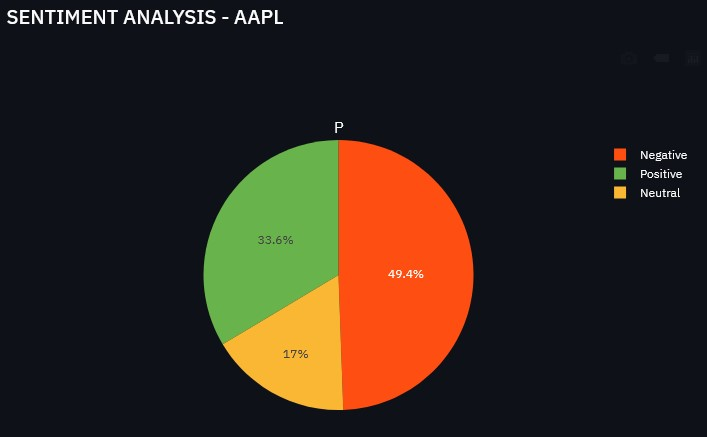
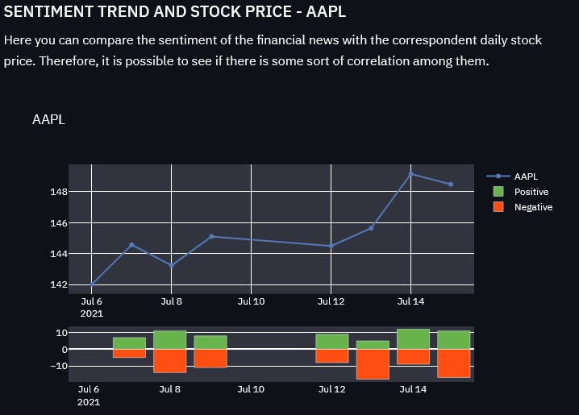

# Financial Sentiment Analysis


<p align="center">
  
  
</p>

| **License** | **Language** | **Libraries** |
| ----- | ---- | ---- |
|  |  |     


### Contents
- [Description](#description)
- [Dataset](#dataset)
- [Task](#task)
- [Solutions](#solutions)
- [How to run it](#howtorun)
- [How to contribute](#howtocontribute)
- [Demo](#demo)
- [Authors](#authors)

------------------------

<a name="description"/>

## Description
Development of a custom sentiment analysis model related to **financial news**

<a name="dataset"/>

## Dataset
Data are extracted by *scraping* **yahoo finance** and **twitter posts**

<a name="task"/>

## Task
Text Classification

<a name="solutions"/>

## Solutions
- Existent Models
  - Spacy model
  - Bert model

---------
- Custom Models
  - CNN Network
  - *CNN-LSTM Network* (**Work in progress**)

------------------------
<a name="howtorun"/>

## How to run 
0. Create a new virtual environment
```
python -m venv ./venv
source venv/bin/activate
pip install --upgrade pip
```
1. Clone the repository and move to the downloaded directory
```
git clone https://github.com/daniele21/Financial_Sentiment_Analysis.git
cd Financial_Sentiment_Analysis 
```
2. Request [Polyglon's API key]() (FREE)
3. Write the given key in 'files/api_key_polyglon.txt' 
```
echo API_KEY > files/api_key_polyglon.txt
```
4. Install the requirements
```
pip install requirements.txt
```
5. Run local server and dashboard
```
python api_server.py
streamlit run main.py
```
6. You're ready to go! 

<a name="howtocontribute"/>

## How to contribute
1. Fork the repository
2. Do the desired changes
3. Make a pull request

<a name="demo" />

## Demo (GIF)
<p align="center">
  
</p>


<a name="authors"/>

#### Authors

[](https://www.linkedin.com/in/daniele-moltisanti/)
[](https://daniele21.github.io)


[](https://www.linkedin.com/in/francescodisalvo-pa/)
